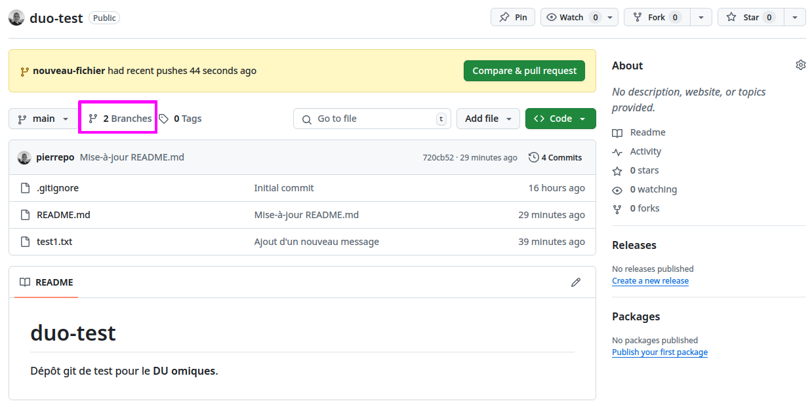
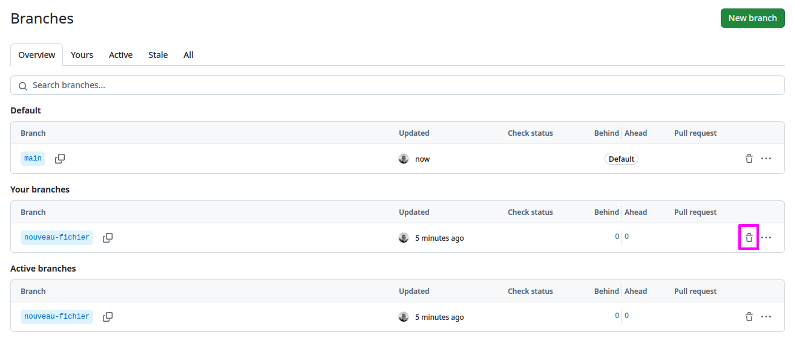

# Utiliser les branches

Depuis un terminal dans l'application JupyterLab de l'IFB, déplacez-vous dans le répertoire de travail pour cette introduction à git :

```bash
$ cd /shared/projects/2501_duo/$USER/intro-git
```

```{admonition} Rappel
:class: tip
- Ne tapez pas le caractère `$` en début de ligne et faites bien attention aux majuscules et au minuscules.
-  Copiez / collez les commandes pour aller plus vite et faire moins d'erreur.
```

Vérifiez que vous êtes dans le bon répertoire :

```bash
$ pwd
/shared/projects/2501_duo/LOGIN-IFB/intro-git
```

où `LOGIN-IFB` est votre identifiant IFB.


## Créer une branche

Revisionnez la vidéo « [Débuter avec Git et Github en 30 min](https://youtu.be/hPfgekYUKgk?t=634) » à partir de 10'34 sur les branches.

Depuis le terminal, revenez dans votre dépôt `duo-test` que vous avez créé précédemment :

```bash
$ cd /shared/projects/2501_duo/$USER/intro-git/duo-test
```

Vérifiez que votre dépôt est « propre », c’est-à-dire qu’il ne contient pas de fichier modifié non commité.

```bash
$ git status
On branch main
Your branch is up to date with 'origin/main'.

nothing to commit, working tree clean
```

Créez une nouvelle branche, par exemple *nouveau-fichier* :

```bash
$ git branch nouveau-fichier
```

Vérifiez que cette branche existe bien :

```bash
$ git branch
* main
  nouveau-fichier
```

Le symbole `*` à gauche de *main* indique que la branche courante est *main*.

Basculez maintenant sur la branche que vous venez de créer :

```bash
$ git switch nouveau-fichier
```

Vérifiez que vous êtes désormais sur la bonne branche :

```bash
$ git branch
  main
* nouveau-fichier
```

Le symbole `*` à gauche de *nouveau-fichier* indique que la branche courante est *nouveau-fichier*.

Créez un nouveau fichier `test2.txt` avec le texte qui vous convient :

```bash
$ echo "Nouveau fichier pour tester une branche" > test2.txt
```

Demandez ensuite à git de prendre en compte votre nouveau fichier :

```bash
$ git add test2.txt
```

Puis réalisez un premier commit :

```bash
$ git commit -m "Création d'un nouveau fichier"
```

Réalisez plusieurs *commits* en modifiant à chaque fois le fichier `test2.txt`, par exemple :

```bash
$ echo "Une ligne supplémentaire" >> test2.txt
$ git add test2.txt
$ git commit -m "Ajout d'une ligne"
$ echo "Et encore une" >> test2.txt
$ git add test2.txt
$ git commit -m "Ajout d'une dernière ligne"
```

Vous pouvez enfin envoyer votre branche sur GitHub. En utilisant la commande :

```bash
$ git push
```

Git va vous renvoyer un message d’erreur :

```
fatal: The current branch nouveau-fichier has no upstream branch.
To push the current branch and set the remote as upstream, use

    git push --set-upstream origin nouveau-fichier

To have this happen automatically for branches without a tracking
upstream, see 'push.autoSetupRemote' in 'git help config'.
```

et vous proposer une instruction plus complète du type :

```bash
$ git push --set-upstream origin nouveau-fichier
```

Utilisez cette instruction pour enfin envoyer votre branche sur GitHub.

```{note}
La commande `git push --set-upstream origin nouveau-fichier` est à utiliser uniquement la première fois que vous envoyez une branche sur GitHub. Par la suite, vous pourrez utiliser la commande `git push` seule.
```

Vérifiez que votre branche `nouveau-fichier` est bien présente sur GitHub en cliquant sur « *Branches* » dans le menu au-dessus de l’aperçu du dépôt :




## Fusionner deux branches

Depuis votre terminal, revenez sur la branche *main* et vérifiez que le fichier `test2.txt` n'est **pas** présent dans votre répertoire :

```bash
$ git switch main
Switched to branch 'main'
Your branch is up to date with 'origin/main'.
$ ls
README.md  test1.txt
```

Les branches fonctionnent comme des « réalités parallèles ». Il est donc normal que le fichier que vous avez créé dans la branche *nouveau-fichier* n’apparaisse pas dans la branche *main*.

Fusionnez maintenant sur la branche actuelle (*main*) la branche *nouveau-fichier* :

```bash
$ git merge nouveau-fichier
```

Vérifiez que le fichier `test2.txt` est présent et contient vos modifications :

```bash
$ ls
README.md  test1.txt  test2.txt
$ cat test2.txt
Nouveau fichier pour tester une branche
Une ligne supplémentaire
Et encore une
```

## Supprimer une branche

La branche *nouveau-fichier* ne sert plus à rien, car les modifications qu’elle contenait ont été fusionnées (incorporées) dans la branche *main*. Vous pouvez donc supprimer la branche *nouveau-fichier* :

```bash
$ git branch -d nouveau-fichier
```

Puis vérifiez qu'elle a bien été détruite :

```bash
$ git branch
* main
```

Enfin, envoyez toutes vos modifications sur GitHub :

```bash
$ git push
```

Vérifiez que le dépôt sur GitHub a été mis à jour.

Pour terminer, supprimer la branche *nouveau-fichier* sur GitHub. Pour cela :

- Cliquez sur « *Branches* » dans l'interface GitHub.
- Cliquez sur l'icône « poubelle » au bout de la ligne *nouveau-fichier*.


