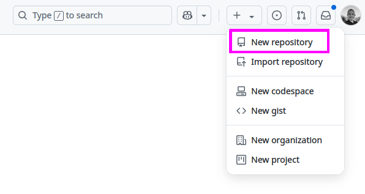
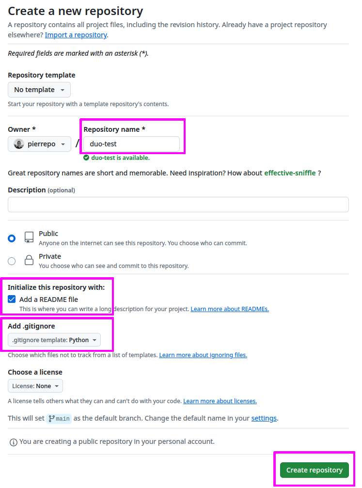
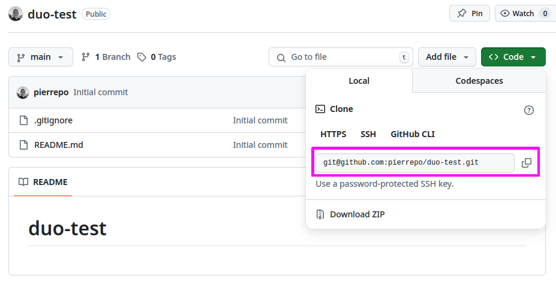
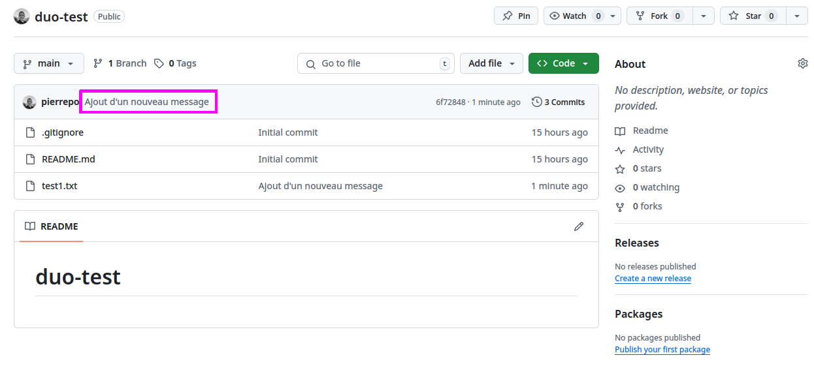
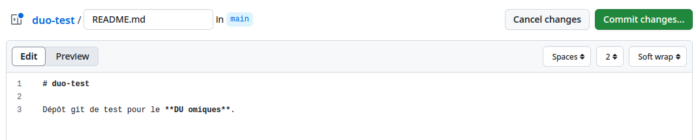
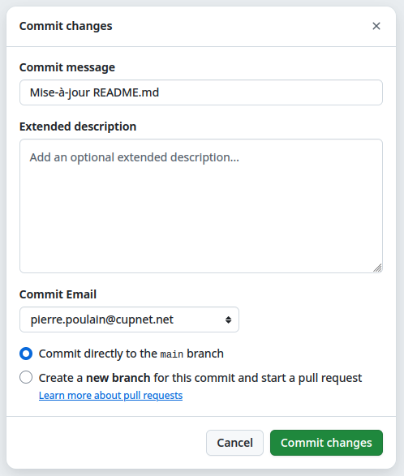
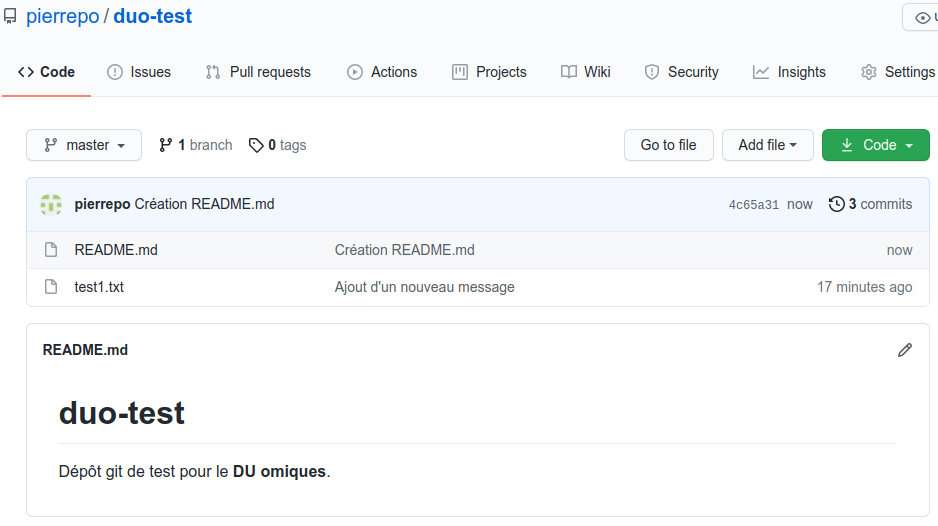

# Créer un premier dépôt

## 1. Création d'un nouveau dépôt sur GitHub

Dans l'interface de GitHub, tout en haut à droite, cliquez sur le symbole `+` puis sur « *New repository* » :



Indiquez ensuite *duo-test* comme « *Repository name* » :



Laissez tous les autres paramètres par défaut.

Puis cliquez sur le bouton vert « *Create repository* ».

Enfin, notez et copiez l'adresse de connexion de votre dépôt qui débute par `git@github.com`, vous en aurez besoin pour la suite :




```{warning}
Si l'adresse de votre dépôt ne débute pas par `git@github.com` mais par `https://github.com` alors cliquez sur le bouton gris « *SSH* » pour obtenir l'adresse qui débute par `git@github.com`
```

## 2. Connexion du dépôt distant (sur GitHub) à votre machine locale

Depuis un terminal sur le JupyterLab de l'IFB, vérifiez que vous êtes dans le bon répertoire de travail :

```bash
$ pwd
/shared/projects/202304_duo/LOGINIFB/intro-git
```

où `LOGINIFB` est votre identifiant IFB.

Exécutez ensuite la commande suivante pour cloner votre dépôt distant (qui est sur GitHub) sur le serveur de l'IFB :

```bash
$ git clone git@github.com:LOGINGITHUB/duo-test.git
```

où `LOGINGITHUB` est votre identifiant GitHub (pas celui de l'IFB).

```{note}
- git pourra éventuellement se plaindre avec le message `warning: You appear to have cloned an empty repository.` C'est tout à fait normal, le dépôt est vide pour le moment, mais nous allons rapidement y ajouter des fichiers.
- L'adresse de votre dépôt distant doit commencer par `git@github.com`
```

Déplacez-vous maintenant dans le répertoire créé et qui correspond à votre dépôt git :

```bash
$ cd duo-test
```

Affichez le contenu du répertoire.

Ce répertoire ne contient rien. C'est normal, votre dépôt est vide. Mais ce répertoire est un peu particulier car il contient en fait un répertoire caché `.git`. Affichez ce répertoire caché avec la commande :

```bash
$ ls -al
```

C'est ce répertoire qui va contenir toute la mémoire du dépôt, donc tout l'historique du dépôt. 🧐 Ne le supprimez pas et ne modifiez pas non plus.

```{note}
L'option `-a` de la commande `ls` affiche tous les fichiers et répertoires d'un répertoire, y compris les fichiers et répertoires cachés qui débutent par un point.
```

## 3. Configuration du dépôt local

Avant de commencer à créer et modifier des fichiers dans votre dépôt, il faut dire à git qui vous êtes :

```bash
$ git config --global user.name "Prénom Nom"
$ git config --global user.email "moi@mail.com"
```

```{warning}
Adaptez le prénom, le nom et l'adresse e-mail à votre cas. Veillez à conserver les guillemets autour de `Prénom Nom` dans la première ligne.
```

Vérifiez que ces paramètres sont bien pris en compte avec la commande :

```bash
$ git config --list | grep user
```

Les paramètres `user.name` et `user.email` devraient contenir les informations que vous avez entrées précédemment.

Configurez également un éditeur par défaut qui peut être utile pour résoudre certains conflits (nous verrons cela plus tard) :

```bash
$ git config --global core.editor "nano"
```

```{note}
Ces commmandes `git config` ne sont à lancer qu'une seule fois sur une machine donnée, ici le cluster de l'IFB.
```


## 4. Exploration des commandes de base

Toujours dans votre dépôt git, créez le fichier `test1.txt` et ajoutez-y du contenu.

Vous pouvez faire cela avec l'éditeur de texte graphique de JupyterLab, l'éditeur de texte dans le terminal `nano` ou plus rapidement avec la commande suivante :

```bash
$ echo "une première ligne" > test1.txt
```

Si vous tapez maintenant la commande `git status` pour savoir ce qui se passe, vous devriez obtenir :

```
$ git status
Sur la branche master

Aucun commit

Fichiers non suivis:
  (utilisez "git add <fichier>..." pour inclure dans ce qui sera validé)
        test1.txt

aucune modification ajoutée à la validation mais des fichiers non suivis sont présents (utilisez "git add" pour les suivre)
```

Le fichier `test1.txt` existe bien mais il n'est pas encore pris en charge par git. Pour cela, il faut utiliser la commande `git add` :

```bash
$ git add test1.txt
```

Un nouveau `git status` renvoie :

```
$ git status
Sur la branche master

Aucun commit

Modifications qui seront validées :
  (utilisez "git rm --cached <fichier>..." pour désindexer)
        nouveau fichier : test1.txt
```

`test1.txt` est désormais pris en compte par git et ses modifications sont prêtes à être validées. Pour cela, nous allons créer un *commit*, c'est-à-dire une photo des fichiers :

```bash
$ git commit -m "Premier commit"
```

Vous devriez obtenir un résultat du type :

```bash
$ git commit -m "Premier commit"
[master (commit racine) a7b7006] Premier commit
 1 file changed, 1 insertion(+)
 create mode 100644 test1.txt
```

Parfait ! Il est maintenant temps d'envoyer ce premier *commit* sur GitHub :

```bash
$ git push
Énumération des objets: 3, fait.
Décompte des objets: 100% (3/3), fait.
Écriture des objets: 100% (3/3), 236 octets | 236.00 Kio/s, fait.
Total 3 (delta 0), réutilisés 0 (delta 0)
To github.com:pierrepo/duo-test.git
 * [new branch]      master -> master
```

Retournez maintenant sur la page de votre dépôt sur GitHub (a priori `https://github.com/LOGINGITHUB/duo-test` avec `LOGINGITHUB` votre identifiant GitHub) et  rafraichissez-la.

Vous devriez voir le fichier `test1.txt` ! 🥳


Depuis le terminal Bash Ubuntu, modifiez une seconde fois le fichier `test1.txt` :

```bash
$ echo "et hop une deuxième ligne" >> test1.txt
```

Visualisez les différences par rapport au *commit* précédent avec la commande :

```bash
$ git diff
```

Une nouvelle ligne est marquée par le symbole `+`. Une ligne supprimée est marquée par le symbole `-`. Les lignes modifiées apparaissent avec le symbole `+` et `-`.

Exemple de résultat :

```bash
$ git diff
diff --git a/test1.txt b/test1.txt
index 0d8e693..f9f2480 100644
--- a/test1.txt
+++ b/test1.txt
@@ -1 +1,2 @@
 une première ligne
+et hop une deuxième ligne
```

Ajoutez (encore) le fichier modifié puis créez un nouveau *commit* :

```bash
$ git add test1.txt
$ git commit -m "Ajout d'un nouveau message"
```

Et envoyez ce nouveau *commit* sur Github :

```bash
$ git push
Énumération des objets: 5, fait.
Décompte des objets: 100% (5/5), fait.
Écriture des objets: 100% (3/3), 305 octets | 305.00 Kio/s, fait.
Total 3 (delta 0), réutilisés 0 (delta 0)
To github.com:pierrepo/duo-test.git
   404b6ff..5adb360  master -> master
```

Retournez sur GitHub pour observer ce nouveau *commit* :




Depuis le terminal, affichez l'historique avec la commande `git log` :

```bash
$ git log
commit 5adb360b9682320e4fe32382d79d9b9454d657b3 (HEAD -> master, origin/master)
Author: Pierre Poulain <pierre.poulain@cupnet.net>
Date:   Tue Apr 6 21:00:36 2021 +0200

    Ajout d'un nouveau message

commit 404b6ff031bd9ba0daa586c7a524eb8ef409ec1c
Author: Pierre Poulain <pierre.poulain@cupnet.net>
Date:   Tue Apr 6 20:52:47 2021 +0200

    Premier commit
```

Si besoin, pressez la touche <kbd>q</kbd> pour quitter le journal de git.

Vous constatez que git mémorise :

- **qui** a créé le *commit* (par exemple : *Pierre Poulain <pierre.poulain@cupnet.net>*) ;
- **quand** le *commit* a été créé (par exemple : *Tue Apr 6 21:00:36 2021 +0200*) ;
- et **pourquoi** il a été créé (par exempe : *Ajout d'un nouveau message*).

Git mémorise aussi quels fichiers ont été modifiés. Nous verrons plus tard comment les retrouver.

De plus, git attribue un identifiant à chaque *commit* (ici : `404b6ff031bd9ba0daa586c7a524eb8ef409ec1c`). Cet identifiant est unique et permet de retrouver un *commit* particulier.

## 5. Modification d'un fichier depuis GitHub

Depuis l'interface de GitHub, cliquez sur le bouton vert « *Add a README* »

Dans l'éditeur en ligne, ajoutez le texte suivant :
```
# duo-test

Dépôt git de test pour le **DU omiques**.
```



En haut à droite de la page, cliquez sur le bouton vert *Commit changes* puis dans la nouvelle fenêtre, indiquez comme titre de *commit* : « Création README.md » (sans les guillemets), et enfin cliquez sur le bouton vert « *Commit new file* ».



Bravo ! Vous avez créé un nouveau *commit*, mais cette fois directement depuis l'interface de GitHub :




Retournez dans le terminal et synchronisez votre dépôt git local avec GitHub :

```bash
$ git pull
remote: Enumerating objects: 4, done.
remote: Counting objects: 100% (4/4), done.
remote: Compressing objects: 100% (3/3), done.
remote: Total 3 (delta 0), reused 0 (delta 0), pack-reused 0
Dépaquetage des objets: 100% (3/3), 716 octets | 358.00 Kio/s, fait.
Depuis github.com:pierrepo/duo-test
   5adb360..4c65a31  master     -> origin/master
Mise à jour 5adb360..4c65a31
Fast-forward
 README.md | 3 +++
 1 file changed, 3 insertions(+)
 create mode 100644 README.md
```

Vérifiez que le fichier `README.md` est bien présent avec la commande `ls` puis affichez son contenu :

```bash
$ cat README.md
```

Vérifiez également que le *commit* créé sur GitHub est bien enregistré dans l'historique :
```bash
$ git log
```

Si besoin, pressez la touche <kbd>q</kbd> pour quitter le journal de git.
