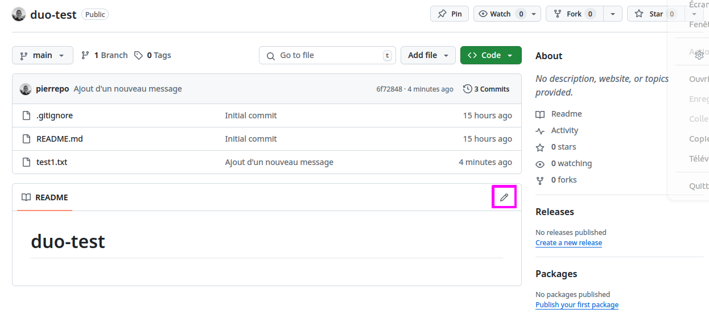

# Créer un premier dépôt

## Création d'un nouveau dépôt sur GitHub

Dans l'interface de GitHub, tout en haut à droite, cliquez sur le symbole `+` puis sur « *New repository* » :


Ensuite :

- Indiquez *duo-test* comme « *Repository name* ».
- Cochez la case « Add a README file »
- Ajoutez un fichier `.gitignore` en choisissant « Python » dans la liste déroulante de la section « Add .gitignore ».

Puis cliquez sur le bouton vert « *Create repository* » :


Enfin, cliquez sur le bouton « Code » et copiez l'adresse de connexion de votre dépôt qui débute par `git@github.com:...`, vous en aurez besoin pour la suite :


```{warning}
Si l'adresse de votre dépôt ne débute pas par `git@github.com` mais par `https://github.com` alors cliquez sur « *SSH* » pour obtenir l'adresse qui débute par `git@github.com:...`
```

## Connexion du dépôt distant (sur GitHub) au cluster de l'IFB

Depuis un terminal dans l'application JupyterLab de l'IFB, vérifiez que vous êtes dans le bon répertoire de travail :

```bash
$ pwd
/shared/projects/2501_duo/LOGIN-IFB/intro-git
```

où `LOGIN-IFB` est votre identifiant IFB.

Exécutez ensuite la commande suivante pour cloner votre dépôt distant (qui est sur GitHub) sur le serveur de l'IFB :

```bash
$ git clone git@github.com:LOGIN-GITHUB/duo-test.git
```

où `LOGIN-GITHUB` est votre identifiant GitHub (pas celui de l'IFB).

```{note}
- L'adresse de votre dépôt distant doit commencer par `git@github.com:...`
```

Déplacez-vous maintenant dans le répertoire créé et qui correspond à votre dépôt git :

```bash
$ cd duo-test
```

Affichez le contenu du répertoire.

Ce répertoire contient le fichier `README.md`. Il contient également des fichiers ou répertoires cachés que vous pouvez afficher avec la commande :

```bash
$ ls -al
```

```{note}
L'option `-a` de la commande `ls` affiche tous les fichiers et sous-répertoires d'un répertoire, y compris les fichiers et répertoires cachés qui débutent par un point.
```

Le fichier `.gitignore` est un fichier caché qui contient la liste des fichiers et répertoires à ignorer par git. Par exemple, les fichiers temporaires créés par l'éditeur de texte ou les fichiers de configuration de l'environnement Python. Ne vous en occupez pas pour l'instant.

Le répertoire `.git` est un répertoire caché. Il contient toute la mémoire du dépôt, donc tout l'historique du dépôt. 🧐 Ne le supprimez pas et ne modifiez pas non plus.


## Configuration du dépôt local

Avant de commencer à créer et modifier des fichiers dans votre dépôt, il faut dire à git qui vous êtes :

```bash
$ git config --global user.name "Prénom Nom"
$ git config --global user.email "moi@mail.com"
```

```{warning}
Adaptez le prénom, le nom et l'adresse e-mail à votre cas. Veillez à conserver les guillemets autour de `Prénom Nom` dans la première ligne.
```

Vérifiez que ces paramètres sont bien pris en compte avec la commande :

```bash
$ git config --list | grep user
```

Les paramètres `user.name` et `user.email` devraient contenir les informations que vous avez entrées précédemment.

Configurez également un éditeur par défaut qui peut être utile pour résoudre certains conflits (nous verrons cela plus tard) :

```bash
$ git config --global core.editor "nano"
```

```{note}
Ces commmandes `git config` ne sont à lancer qu'une seule fois sur une machine donnée, ici le cluster de l'IFB.
```


## Exploration des commandes de base

Toujours dans votre dépôt git, créez le fichier `test1.txt` et ajoutez-y du contenu.

Vous pouvez faire cela avec l'éditeur de texte graphique de JupyterLab, l'éditeur de texte dans le terminal `nano` ou plus rapidement avec la commande suivante :

```bash
$ echo "une première ligne" > test1.txt
```

Si vous tapez maintenant la commande `git status` pour savoir ce qui se passe, vous devriez obtenir :

```
$ git status
On branch main
Your branch is up to date with 'origin/main'.

Untracked files:
  (use "git add <file>..." to include in what will be committed)
        test1.txt

nothing added to commit but untracked files present (use "git add" to track)
```

Le fichier `test1.txt` existe bien, mais il n'est pas encore pris en charge par git. Pour cela, il faut utiliser la commande `git add` :

```bash
$ git add test1.txt
```

Un nouveau `git status` renvoie :

```
$ git status
On branch main
Your branch is up to date with 'origin/main'.

Changes to be committed:
  (use "git restore --staged <file>..." to unstage)
        new file:   test1.txt
```

`test1.txt` est désormais pris en compte par git et ses modifications sont prêtes à être validées. Pour cela, nous allons créer un *commit*, c'est-à-dire une photo des fichiers :

```bash
$ git commit -m "Premier commit"
```

Vous devriez obtenir un résultat du type :

```bash
$ git commit -m "Premier commit"
[main 0add960] Premier commit
 1 file changed, 1 insertion(+)
 create mode 100644 test1.txt
```

Parfait ! Il est maintenant temps d'envoyer ce premier *commit* sur GitHub :

```bash
$ git push
Enumerating objects: 4, done.
Counting objects: 100% (4/4), done.
Delta compression using up to 256 threads
Compressing objects: 100% (2/2), done.
Writing objects: 100% (3/3), 334 bytes | 167.00 KiB/s, done.
Total 3 (delta 0), reused 0 (delta 0), pack-reused 0 (from 0)
To github.com:pierrepo/duo-test.git
   eeb37d5..0add960  main -> main
```

Retournez maintenant sur la page de votre dépôt sur GitHub (a priori `https://github.com/LOGIN-GITHUB/duo-test` avec `LOGIN-GITHUB` votre identifiant GitHub) et rafraichissez-la.

Vous devriez voir le fichier `test1.txt` ! 🥳


Depuis le terminal, modifiez une seconde fois le fichier `test1.txt` :

```bash
$ echo "et hop une deuxième ligne" >> test1.txt
```

Visualisez les différences par rapport au *commit* précédent avec la commande :

```bash
$ git diff
```

Une nouvelle ligne est marquée par le symbole `+`. Une ligne supprimée est marquée par le symbole `-`. Les lignes modifiées apparaissent avec le symbole `+` et `-`.

Exemple de résultat :

```bash
$ git diff
diff --git a/test1.txt b/test1.txt
index 0d8e693..c16a7f4 100644
--- a/test1.txt
+++ b/test1.txt
@@ -1 +1,2 @@
 une première ligne
+et hop une deuxième ligne
```

Ajoutez (encore) le fichier modifié puis créez un nouveau *commit* :

```bash
$ git add test1.txt
$ git commit -m "Ajout d'un nouveau message"
```

Et envoyez ce nouveau *commit* sur Github :

```bash
$ git push
Enumerating objects: 5, done.
Counting objects: 100% (5/5), done.
Delta compression using up to 256 threads
Compressing objects: 100% (2/2), done.
Writing objects: 100% (3/3), 309 bytes | 154.00 KiB/s, done.
Total 3 (delta 1), reused 0 (delta 0), pack-reused 0 (from 0)
remote: Resolving deltas: 100% (1/1), completed with 1 local object.
To github.com:pierrepo/duo-test.git
   0add960..6f72848  main -> main
```

Retournez sur GitHub pour observer ce nouveau *commit* :


Depuis le terminal, affichez l'historique (le journal des actions réalisées sur le dépôt) avec la commande `git log` :

```bash
$ git log
commit 6f7284840f9c7eafb4278684e8491589698aba3e (HEAD -> main, origin/main, origin/HEAD)
Author: Pierre Poulain <pierre.poulain@cupnet.net>
Date:   Wed Jun 11 10:50:58 2025 +0200

    Ajout d'un nouveau message

commit 0add960d4bbfcb88a3e1db902296c44c83c71ba6
Author: Pierre Poulain <pierre.poulain@cupnet.net>
Date:   Wed Jun 11 10:47:42 2025 +0200

    Premier commit

commit eeb37d5969c35c8a885f0697fecd9bdf5da3b873
Author: Pierre Poulain <pierre.poulain@cupnet.net>
Date:   Tue Jun 10 19:17:35 2025 +0200

    Initial commit
```

Si besoin, pressez la touche <kbd>q</kbd> pour quitter le journal de git.

Vous constatez que git mémorise :

- **qui** a créé le *commit* (par exemple : *Pierre Poulain <pierre.poulain@cupnet.net>*) ;
- **quand** le *commit* a été créé (par exemple : *Wed Jun 11 10:50:58 2025 +0200*) ;
- et **pourquoi** il a été créé (par exemple : *Ajout d'un nouveau message*).

Git mémorise aussi quels fichiers ont été modifiés. Nous verrons plus tard comment les retrouver.

De plus, git attribue un identifiant à chaque *commit* (ici : `6f7284840f9c7eafb4278684e8491589698aba3e`). Cet identifiant est unique et permet de retrouver un *commit* particulier.

```{note}
git vous présente 3 *commits* alors que vous n'en avez créé que 2. Le premier *commit* (avec pour message *Initial commit*) est celui créé automatiquement par GitHub lors de la création du dépôt. Il contient le fichier `README.md` et le fichier `.gitignore`.
```


## Modification d'un fichier depuis GitHub

Depuis l'interface de GitHub, cliquez sur le crayon à droite de « *README* » :



Dans l'éditeur en ligne, ajoutez le texte suivant :

```
# duo-test

Dépôt git de test pour le **DU omiques**.
```


En haut à droite de la page, cliquez sur le bouton vert *Commit changes...* puis dans la nouvelle fenêtre, indiquez comme titre de *commit message* : « Mise-à-jour README.md » (sans les guillemets), et enfin cliquez sur le bouton vert « *Commit changes* ».


Bravo ! Vous avez créé un nouveau *commit*, mais cette fois directement depuis l'interface de GitHub :


Pour revenir à la base de votre dépôt, cliquez sur le nom du dépôt en haut à gauche de la page.

Retournez dans le terminal et synchronisez votre dépôt git local avec GitHub :

```bash
$ git pull
remote: Enumerating objects: 5, done.
remote: Counting objects: 100% (5/5), done.
remote: Compressing objects: 100% (3/3), done.
remote: Total 3 (delta 0), reused 0 (delta 0), pack-reused 0 (from 0)
Unpacking objects: 100% (3/3), 1022 bytes | 146.00 KiB/s, done.
From github.com:pierrepo/duo-test
   6f72848..720cb52  main       -> origin/main
Updating 6f72848..720cb52
Fast-forward
 README.md | 4 +++-
 1 file changed, 3 insertions(+), 1 deletion(-)
```

Vérifiez que le fichier `README.md` a bien été modifié en affichant son contenu :

```bash
$ cat README.md
# duo-test

Dépôt git de test pour le **DU omiques**.
```

Vérifiez également que le *commit* créé sur GitHub est bien enregistré dans l'historique :

```bash
$ git log
```

Si besoin, pressez la touche <kbd>q</kbd> pour quitter le journal de git.
