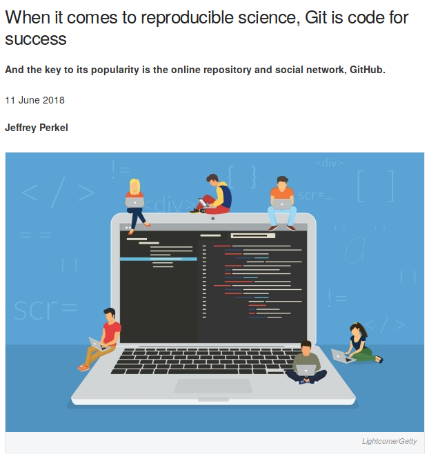

class: center, middle

# Introduction à Git et GitHub

## DU Omiques 2019

Pierre Poulain / @pierrepo

<br /><br /><br /><br /><br /><br />

<div>

 </img>
<div style="display: inline-block; width:100px;"></div>

 </img>
</div>

.footer[
Ce contenu est mis à disposition selon les termes de la licence Creative Commons BY-SA 4.0
]

---

layout: true
name: title
class: center, middle
.footer[
DU Omiques 2019
]

---

layout: true
name: contentleft
class: top, left
.footer[
DU Omiques 2019
]

---

layout: true
name: contentcenter
class: top, center
.footer[
DU Omiques 2019
]

---
template: contentleft

# Objectifs d'apprentissage 

- Expliquer l'utilité de Git et la différence entre Git et GitHub.
  
- Citer les types de fichiers que Git peut prendre en charge.

- Appliquer les principales commandes Git.

- Créer et alimenter un dépôt distant sur GitHub.

- Explorer un dépôt Git existant.

---

.center[

]

.footnote[.ref[
	Source : [PhD Comics](http://phdcomics.com/comics/archive.php?comicid=1531)
]]

---

## Votre script R... 3 mois... 1 an après

---
template: contentleft

## Lequel choisir ?

```bash
$ ls
R_script_03-04-2018.R        R_script_final_modified2.R
R_script_17-06-2018.R        R_script_final.R
R_script_18-03-2018.R        R_script_OK.R
R_script_final_2018-09-20.R  R_script.R
R_script_final_final.R       R_script_really_final.R
```

---
template: contentleft

## Tri par date

```bash
$ ls -lt
total 40
-rw-r--r-- 1 pierre pierre 3015 oct.   2 16:45 R_script_final_modified2.R
-rw-r--r-- 1 pierre pierre 2124 sept. 28 11:58 R_script_really_final.R
-rw-r--r-- 1 pierre pierre 2167 sept. 25 01:05 R_script_final_final.R
-rw-r--r-- 1 pierre pierre 2167 sept. 22 09:56 R_script_OK.R
-rw-r--r-- 1 pierre pierre 2130 sept. 20 10:36 R_script_final_2018-09-20.R
-rw-r--r-- 1 pierre pierre 3700 sept.  1 16:41 R_script_final.R
-rw-r--r-- 1 pierre pierre 2125 juin  19 18:15 R_script_17-06-2018.R
-rw-r--r-- 1 pierre pierre 1067 avril  3  2018 R_script_03-04-2018.R
-rw-r--r-- 1 pierre pierre 1485 mars  18  2018 R_script_18-03-2018.R
-rw-r--r-- 1 pierre pierre 1670 févr. 24  2018 R_script.R
```

---
template: contentleft

## Tri par taille

```bash
$ ls -lS
total 40
-rw-r--r-- 1 pierre pierre 3700 sept.  1 16:41 R_script_final.R
-rw-r--r-- 1 pierre pierre 3015 oct.   2 16:45 R_script_final_modified2.R
-rw-r--r-- 1 pierre pierre 2167 sept. 25 01:05 R_script_final_final.R
-rw-r--r-- 1 pierre pierre 2167 sept. 22 09:56 R_script_OK.R
-rw-r--r-- 1 pierre pierre 2130 sept. 20 10:36 R_script_final_2018-09-20.R
-rw-r--r-- 1 pierre pierre 2125 juin  19 18:15 R_script_17-06-2018.R
-rw-r--r-- 1 pierre pierre 2124 sept. 28 11:58 R_script_really_final.R
-rw-r--r-- 1 pierre pierre 1670 févr. 24  2018 R_script.R
-rw-r--r-- 1 pierre pierre 1485 mars  18  2018 R_script_18-03-2018.R
-rw-r--r-- 1 pierre pierre 1067 avril  3  2018 R_script_03-04-2018.R
```

---
template: contentleft

# Gestionnaires de versions

(*version control systems*)

--

.leftcol[
CVS (1990)

Subversion / SVN (2000)

Git (2005)

Mercurial (2005)

Bazaar (2005)

Veracity (2011)
]

--

.rightcol[

### Qui ? Quand ? Pourquoi ?

Qui a modifié le fichier ? 💻

Quand le fichier a été modifié ? 💻

Pourquoi le fichier a été modifié ? 🤓

]

--

<div style="clear:both;"></div>

### Quoi ?

Des fichiers **textes** relativement « petits » (< 100 Mo)

---


.footnote[
	.ref[[DOI 10.1371/journal.pcbi.1003285](https://doi.org/10.1371/journal.pcbi.1003285)]
]

--

<div style="background: #dfdfdf;
			font-size: 1.5rem;
			padding: 15px;
			border-radius: 15px;
			diplay: block;
			position: absolute;
			bottom: 150px;
			right: 220px;">
<q>Rule 4: Version Control All Custom Scripts</q>
</div>

---
template: contentleft

.leftcol[

]

.rightcol[
.bigger[
> “Most researchers are primarily collaborating with themselves,” [Tracy] Teal explains. “So, we teach it from the perspective of being helpful to a ‘future you’."
]
]

.footnote.ref[
	J. Perkel, [Nature Index, 2018](https://www.natureindex.com/news-blog/when-it-comes-to-reproducible-science-git-is-code-for-success)
]


---
template: contentleft

# Activité préparatoire 


Débuter avec Git et Github en 30 min
<iframe width="560" height="315" src="https://www.youtube-nocookie.com/embed/hPfgekYUKgk?rel=0&amp;showinfo=0" frameborder="0" allow="autoplay; encrypted-media" allowfullscreen></iframe>
.ref[
	https://www.youtube.com/watch?v=hPfgekYUKgk
]

--

.center.bigger[
	Un truc compris 🤩 / un truc pas compris 😱
]

---
template: contentleft

# Activité préparatoire / mémo

Dans un terminal, dans un répertoire

.leftcol[

```bash
# Définir son identité. À faire une seule fois.
$ git config --global user.name "Prénom Nom"
$ git config --global user.email "moi@mail.com"

# Vérifier si Git est bien installé (et afficher la version).
$ git --version

# Initialiser le répertoire (= dépôt).
$ git init

# Afficher le statut du dépôt.
$ git status

# Sélectionner les fichiers à enregistrer.
$ git add <nom-du-fichier>
# Enregistrer l'état (= prendre la photo).
$ git commit -m "Texte d'explication"

# Afficher l'historique.
# Touche q pour quitter.
$ git log
```

]

.rightcol[

```bash
# Lister les branches.
$ git branch 
# Créer une branche.
$ git branch <nom-d-une-branche>
# Changer de branche.
$ git checkout <nom-d-une-branche-existante>
# Fusionner deux branches.
$ git branch <nom-d-une-branche-existante>
# Supprimer une branche.
$ git branch -d <nom-d-une-branche-existante>
```

Avec Github
```bash
# Ajouter un dépôt distant (sur GitHub).
$ git remote add <adresse-du-dépôt>
# Affichez les dépôts distants.
$ git remote
# Récupérer les modifications depuis GitHub.
$ git pull origin master
# Envoyer les modifications sur Github.
$ git push origin master
```

]

---
template: title

# Récap ?

[www.wooclap.com/DUOGIT](https://app.wooclap.com/DUOGIT)

---
template: contentleft

## Bonnes pratiques

### Que met-on dans un dépôt Git ?

--

Des fichiers avec lesquels Git peut « calculer » la différence entre deux versions.

--

Le plus souvent des fichiers *texte* de taille *raisonnable* :

- un script R ✅
- un fichier PDF ❌
- un script Python ✅
- un fichier fastq ❌
- une image (❌ si générée automatiquement, sinon ✅)
- un fichier raw (protéomique) ❌


---
template: contentleft

### Pas toujours simple ;-)

.center[
	
	</img>
]

.footnote.ref[
	[XKCD](https://xkcd.com/1597/)
]

---
template: contentleft
background-color: #cccccc

# C'est parti ! 🚀

## 💻 [Tutoriel](https://omics-school.github.io/git-github/tutoriel/)

## Le cours [Version Control with Git](https://swcarpentry.github.io/git-novice/) de Software Carpentry